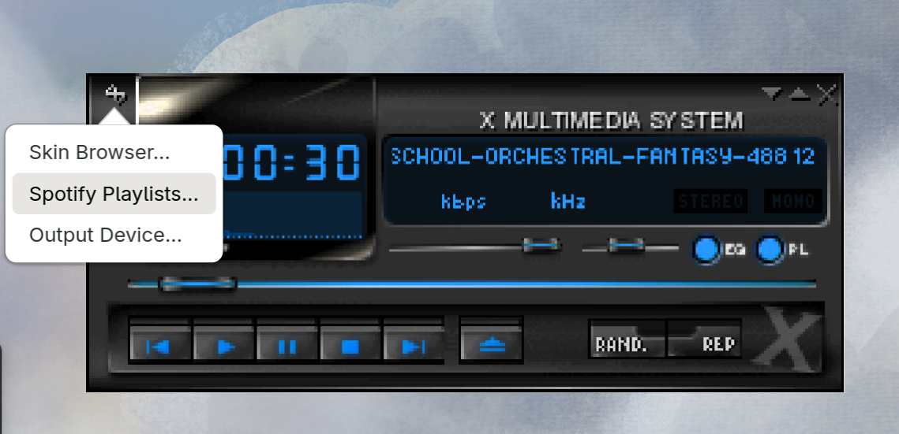
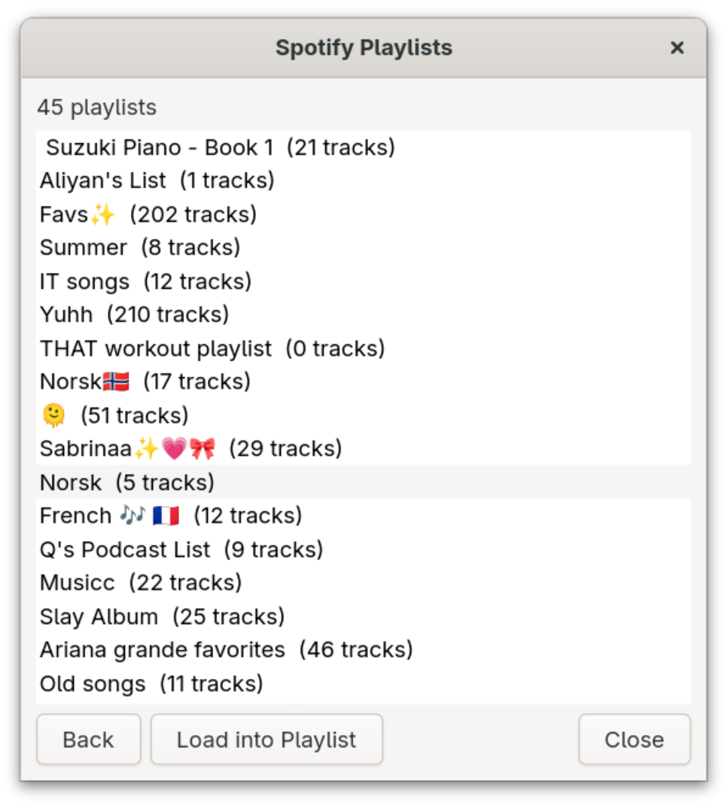

# XMMS Resuscitated

A modernized version of the classic [XMMS](https://en.wikipedia.org/wiki/XMMS) (X Multimedia System) music player, rebuilt with GTK 4 and GStreamer while preserving the original Winamp 2.x skin compatibility.

## Download

Pre-built Flatpak bundles are available from the [latest release](https://gitlab.com/cschalle/xmms-resuscitated/-/releases). Install with:

```sh
flatpak install xmms-resuscitated.flatpak
```

## Features

- **Winamp-compatible skins** — load classic `.wsz`/`.zip` skin archives or directories
- **10-band equalizer** with preamp and real-time response curve
- **Spectrum analyzer** visualization
- **Playlist editor** with drag-and-drop support
- **MPRIS2 D-Bus interface** for media key integration
- **Spotify integration** — browse playlists, stream tracks, and control playback via the Spotify Web API (no setup required, client ID is built-in)
- **Unified output device picker** — seamlessly switch between local audio, network devices, and Spotify Connect devices
- **Skin browser** for switching between installed skins
- **Flatpak support** — available as a portable Flatpak bundle
- Wide audio format support via GStreamer (MP3, OGG, FLAC, WAV, AAC, and more)

## Screenshots

### Main Player


### Playlist Editor


### Spotify Integration


### Spotify Playlist Chooser


## Dependencies

- GTK 4 (>= 4.6)
- GStreamer 1.x (>= 1.16) with `gstreamer-plugins-base` and `gstreamer-plugins-good`
- libsoup 3.0 (>= 3.0)
- json-glib (>= 1.6)
- libarchive (>= 3.0, optional — for skin archive extraction)

### Fedora

```sh
sudo dnf install gtk4-devel gstreamer1-devel gstreamer1-plugins-base \
    gstreamer1-plugins-good libsoup3-devel json-glib-devel \
    libarchive-devel meson gcc
```

### Ubuntu / Debian

```sh
sudo apt install libgtk-4-dev libgstreamer1.0-dev \
    gstreamer1.0-plugins-base gstreamer1.0-plugins-good \
    libsoup-3.0-dev libjson-glib-dev libarchive-dev meson gcc
```

## Building

```sh
meson setup builddir
meson compile -C builddir
```

To install system-wide:

```sh
meson install -C builddir
```

## Running

After building, run directly from the build directory:

```sh
./builddir/xmms
```

Or after installing:

```sh
xmms
```

Pass files or directories on the command line to add them to the playlist:

```sh
xmms ~/Music/*.mp3
```

Start with the playlist or equalizer opened:

```sh
xmms --playlist
xmms --equalizer
```

## Skins

XMMS Resuscitated supports Winamp 2.x compatible skins. Place skin files in:

- `~/.config/xmms/Skins/` — user skin directory
- `/usr/share/xmms/Skins/` — system skin directory

Skins can be `.wsz`, `.zip`, `.tar`, `.tar.gz`, or `.tar.bz2` archives, or unpacked directories. Use **Alt+S** to open the skin browser.

## Keyboard Shortcuts

| Key | Action |
|-----|--------|
| `z` | Previous track |
| `x` | Play |
| `c` | Pause |
| `v` | Stop |
| `b` | Next track |
| `Alt+E` | Toggle playlist window |
| `Alt+G` | Toggle equalizer window |
| `Alt+S` | Open skin browser |
| `Up/Down` | Volume up/down |
| `Left/Right` | Seek backward/forward 5 seconds |

## Building an RPM (Fedora)

A spec file is included for building Fedora RPMs:

```sh
rpmbuild -bs xmms.spec
mock <resulting .src.rpm>
```

## License

GNU General Public License v2.0 or later. See [COPYING](COPYING) for details.

## Credits

Originally written by Peter Alm, Thomas Nilsson, Olle Hallnas, and Havard Kvalen.
Modernized for GTK 4 and GStreamer.
