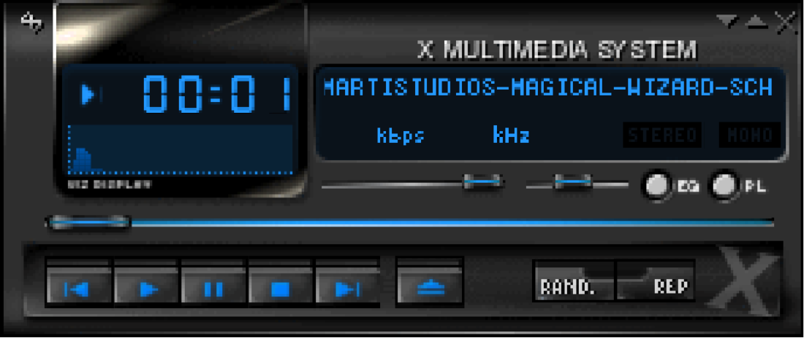
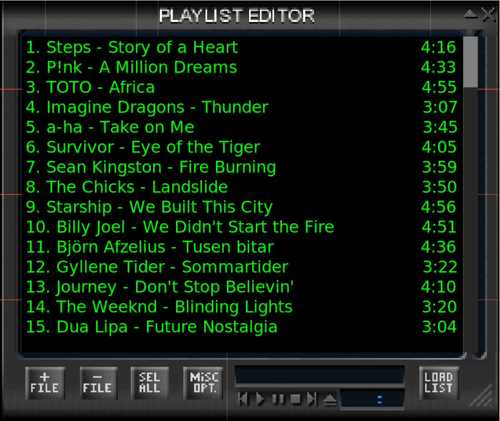

# XMMS Renascene

A modernized version of the classic [XMMS](https://en.wikipedia.org/wiki/XMMS) (X Multimedia System) music player, rebuilt with GTK 4 and GStreamer while preserving the original Winamp 2.x skin compatibility.

## Features

- **Winamp-compatible skins** — load classic `.wsz`/`.zip` skin archives or directories
- **10-band equalizer** with preamp and real-time response curve
- **Spectrum analyzer** visualization, Milkdrop inspired
- **Playlist editor** with drag-and-drop support
- **MPRIS2 D-Bus interface** for media key integration
- **Unified output device picker** — seamlessly switch between local and network audio devices
- **Skin browser** for switching between installed skins
- **Skin editor** for live pixel editing, cloning/saving skins, and exporting Winamp `.wsz` files
- Wide audio format support via GStreamer (MP3, OGG, FLAC, WAV, AAC, and more)
- Vim-like playlist navigation (j/k, p for playback, / for incremental search)

## Screenshots

### Main Player



### Playlist Editor



## Dependencies

- GTK 4 (>= 4.6)
- GStreamer 1.x (>= 1.16) with `gstreamer-plugins-base` and `gstreamer-plugins-good`
- Rust/Cargo
- C compiler and `pkg-config` for native Rust dependencies

### Fedora

```sh
sudo dnf install gtk4-devel gstreamer1-devel gstreamer1-plugins-base \
    gstreamer1-plugins-good gcc pkgconf-pkg-config cargo
```

### Ubuntu / Debian

```sh
sudo apt install libgtk-4-dev libgstreamer1.0-dev \
    gstreamer1.0-plugins-base gstreamer1.0-plugins-good \
    build-essential pkg-config cargo
```

## Building

```sh
cargo build
```

For an optimized build:

```sh
cargo build --release
```

To install with Cargo:

```sh
cargo install --path .
```

## Running

The helper script shows command help by default:

```sh
./repo
```

To build when needed and start the GTK application:

```sh
./repo run
```

## Flatpak installer

A local Flatpak manifest is provided as `org.xmms.Renascene.yml`.
To build and install XMMS Renascene into your user Flatpak installation:

```sh
./repo create_flatpack
```

The installer is implemented in Python and requires `flatpak` and
`flatpak-builder`. It adds Flathub if needed, installs the GNOME 49 SDK/runtime
and Rust SDK extension, builds the Rust release binary with vendored Cargo
crates, and installs the app as `org.xmms.Renascene`.

After installation, run it with:

```sh
flatpak run org.xmms.Renascene
```

The same release bundle build used by CI can be run locally with:

```sh
python3 scripts/flatpak.py build-release-bundle
```

Tagged GitHub releases build and attach a single-file Flatpak bundle named
`xmms-renascene_<git-sha>.flatpack`. Install a downloaded release bundle with:

```sh
flatpak install --user ./xmms-renascene_<git-sha>.flatpack
flatpak run org.xmms.Renascene
```

Maintainers can publish a new downloadable release by pushing a version tag:

```sh
git tag v2.0.0
git push origin v2.0.0
```

## Skins

XMMS RS supports Winamp 2.x compatible skins. Place skin files in:

- `~/.config/xmms/Skins/` — user skin directory
- `/usr/share/xmms/Skins/` — system skin directory

Skins can be `.wsz`, `.zip`, `.tar`, `.tar.gz`, or `.tar.bz2` archives,
or unpacked directories. Use **Alt+S** to open the skin browser.

The **Skin Editor** is available from the player menu. It opens in a separate
window, shows every skin pixmap on one canvas, exposes playlist, visualization,
and text color swatches, provides a popup custom color wheel with a 32-slot color
shelf, supports brush, spraycan, color picker, drag/pan, line, rectangle,
select/copy/cut/paste, lighten, darken, and dither tools, updates the player
live as you paint, saves edited skins into the user skin directory, and exports
Winamp-compatible `.wsz` archives.

## Keyboard Shortcuts

|Key|Action|
|---|---|
|`z`|Previous track|
|`x`|Play|
|`c`|Pause|
|`v`|Stop|
|`b`|Next track|
|`Alt+E`|Toggle playlist window|
|`Alt+G`|Toggle equalizer window|
|`Alt+S`|Open skin browser|
|`Up/Down`|Volume up/down|
|`Left/Right`|Seek backward/forward 5 seconds|

## License

GNU General Public License v2.0 or later. See [COPYING](COPYING) for details.

## Credits

Originally written by Peter Alm, Thomas Nilsson, Olle Hallnas, and Havard
Kvalen <https://sourceforge.net/projects/xmms/>
Modernized for GTK 4 and GStreamer by Christian Schaller
<https://gitlab.com/cschalle/xmms-renascene>.
Ported to Rust (AI Assisted)
